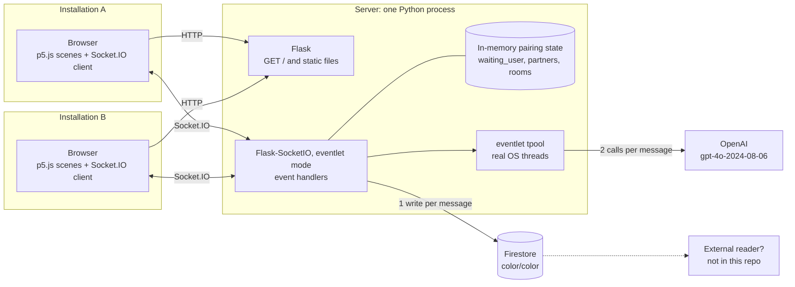
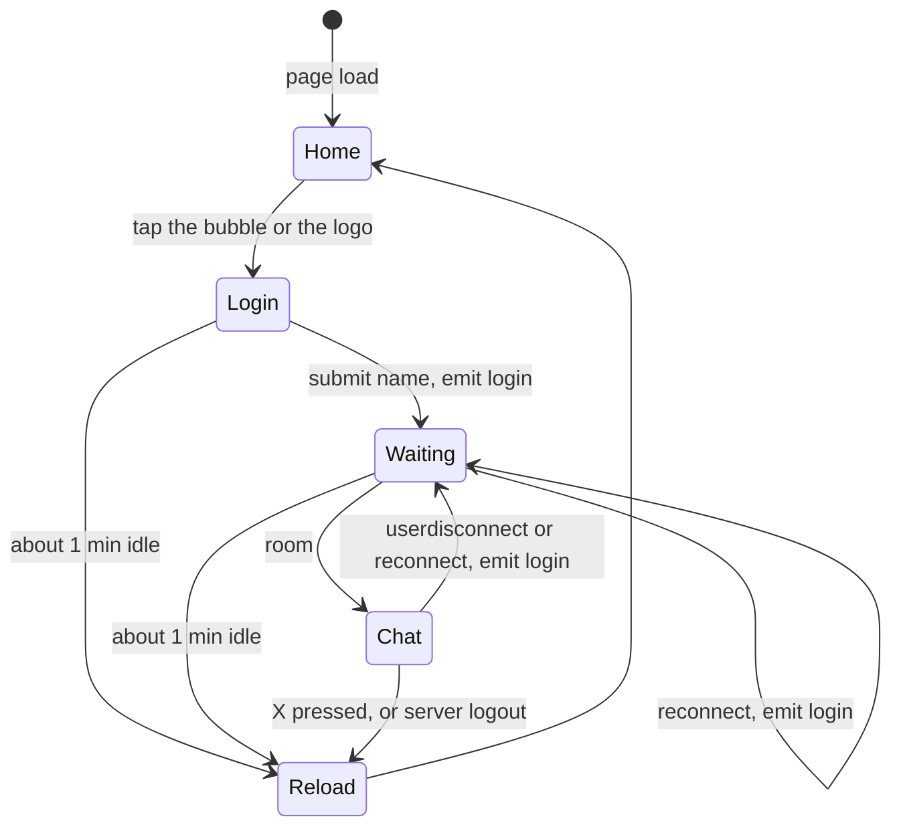
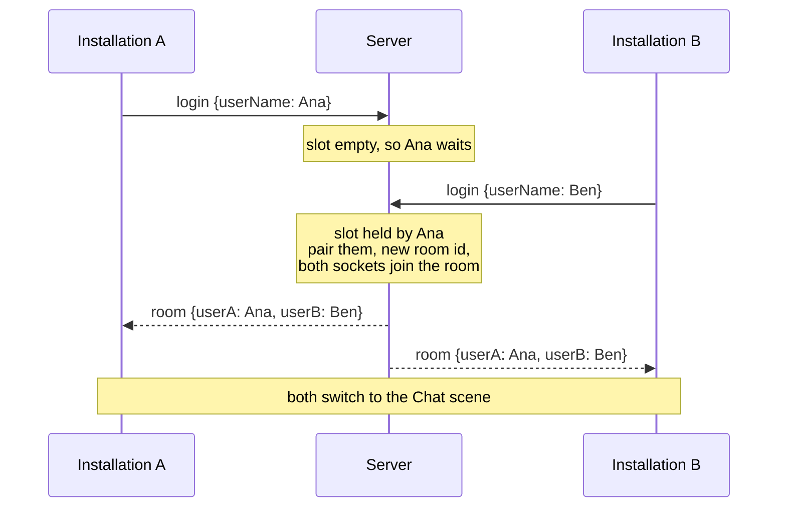
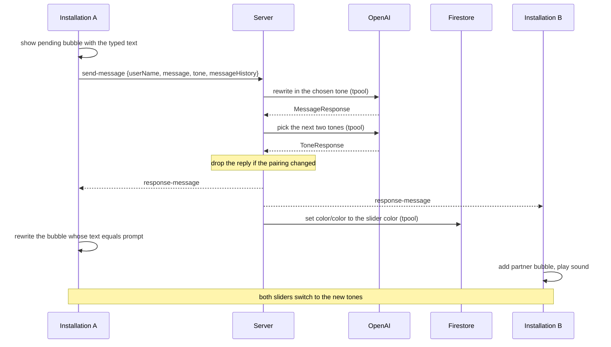
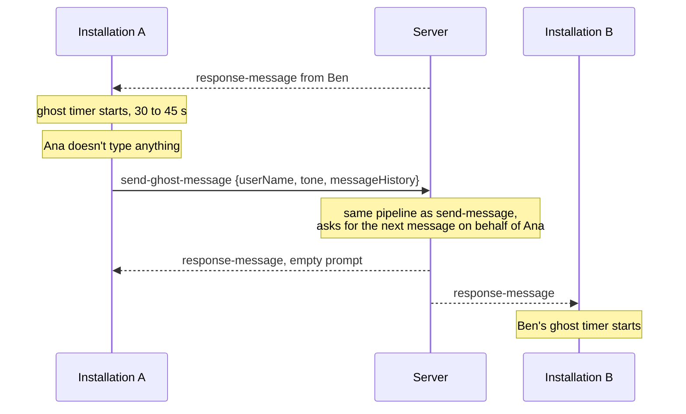
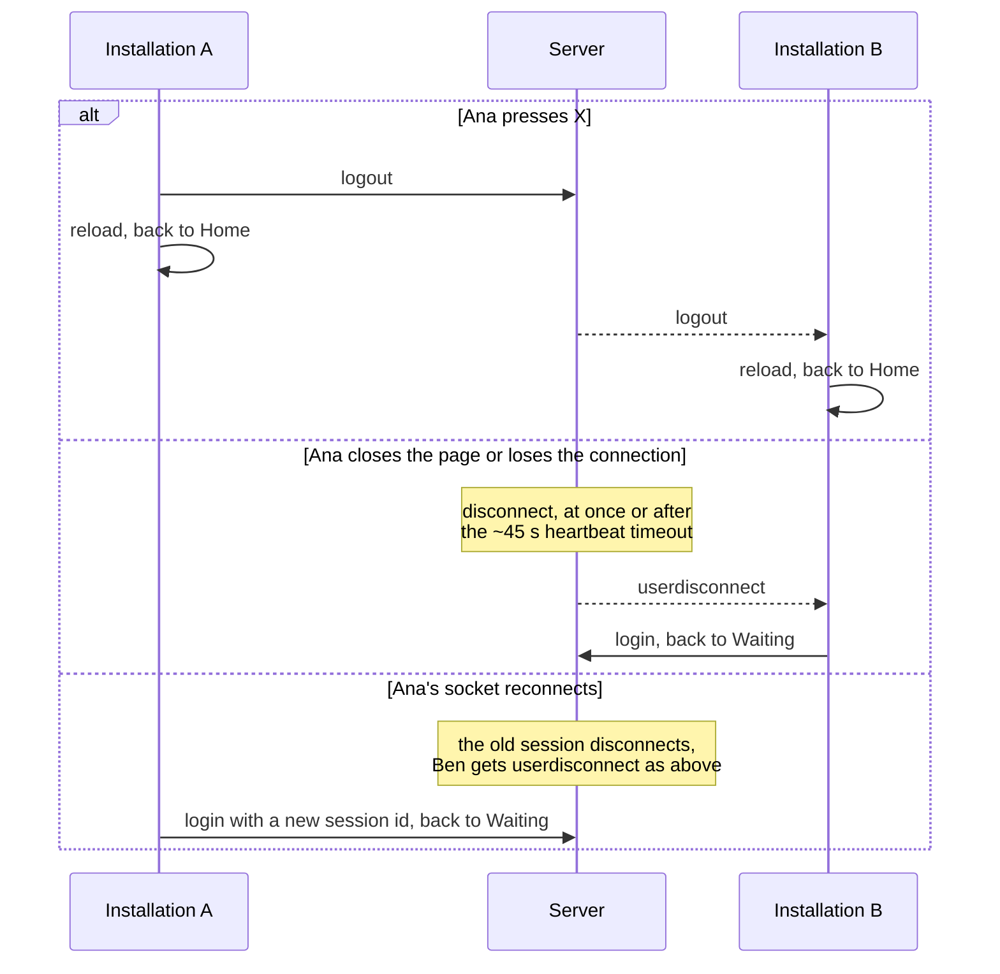

# Architecture

In Between Us connects two installations. A visitor at each one types a name, is paired with the visitor at the other installation, and they chat. Every message goes through OpenAI and is rewritten in the tone the sender picked on a slider before either side sees it. If a visitor stays silent, the AI writes a message on their behalf.

This document describes the code as of `c0b53ca` plus the uncommitted scene refactor ([scene.js](src/web/static/js/scene.js)). Line links will drift as the code changes. The [README](README.md) has a shorter summary, and [todo.md](todo.md) tracks open work.

## 1. System overview



- **Two browser clients.** Each installation is a browser showing the same page. Nothing tells them apart: the server treats any browser that opens the URL as a possible installation.
- **One server process.** Flask serves the page and static files. Flask-SocketIO, in eventlet mode, handles the socket events. All pairing state is in memory, so the server must run as a single process on a single instance.
- **OpenAI.** Each message costs two structured-output calls: one rewrites the text, the other picks the next pair of tones for the slider.
- **Firestore.** Only one document is used, `color/color`. It's overwritten with the sender's slider color on every delivered message. Nothing in this repo reads it back. If nothing outside the repo reads it either, the whole Firebase dependency can go.

## 2. Server

| File | Role |
| --- | --- |
| [main.py](src/main.py) | App setup, socket handlers, pairing state, OpenAI and Firestore calls |
| [models.py](src/models.py) | Dataclasses for socket payloads, Pydantic models for OpenAI structured outputs |
| [config.py](src/config.py) | Reads `config.toml` (API key), defines the tone table and the tone prompt |
| [utils/json.py](src/utils/json.py) | snake_case ↔ camelCase conversion for payloads |

### Pairing state

```python
waiting_user: Optional[User]   # the one session waiting for a partner
partners: dict[str, User]      # session id -> the user they're talking to
rooms: dict[str, str]          # session id -> Socket.IO room id
```

A session is always in one of three states:

| State | Where it's recorded | Enters on | Leaves on |
| --- | --- | --- | --- |
| Connected | Nowhere | Socket connect | `login` |
| Waiting | `waiting_user` | `login` while the slot is empty | Someone else logs in, or its own `logout`, disconnect or new `login` |
| Paired | `partners`, `rooms`, and the Socket.IO room | `login` while someone else is waiting | Its own or its partner's `logout`, disconnect or new `login` |

Rules ([on_login](src/main.py#L47-L68), [end_session](src/main.py#L111-L126)):

- There is one waiting slot, first come, first served.
- A `login` first ends whatever the session was doing. If it was paired, the partner gets `userdisconnect`.
- Pairing creates a fresh room id (`uuid4`), puts both sockets in that Socket.IO room, and emits `room` to it.
- `end_session` removes both sides from `partners` and `rooms`, takes both out of the room, and sends the given event (`logout` or `userdisconnect`) to the partner.
- A restart clears everything. Clients in the Waiting or Chat scene log in again when their socket reconnects.

### Handling a message

[`respond()`](src/main.py#L129-L178) runs the same steps for `send-message` and `send-ghost-message`. Only the instruction differs:

1. Look up the sender's room. If they aren't paired, drop the event.
2. **OpenAI call 1:** rewrite the message, or write a new one for a ghost message, using the client-supplied history (`MessageResponse`).
3. **OpenAI call 2:** pick two tones from the list for the next message (`ToneResponse`).
4. If the sender's room changed while OpenAI was answering, drop the reply.
5. Emit `response-message` to the room, so both clients get it.
6. Write the sender's slider color to Firestore. A failure is only logged.

### Concurrency model

- The server runs eventlet **without monkey-patching**, because monkey-patching breaks the gRPC library that Firestore uses. Every handler runs as a green thread on one OS thread, so any blocking call freezes every client.
- OpenAI calls therefore go through `tpool.execute`, which runs them in a real thread (20 s timeout, one retry). The Firestore write does too (5 s timeout, no retry).
- `pairing_lock` is a real `threading.Lock`. That's safe only because nothing inside it yields.
- python-socketio runs each incoming event in its own green thread. Two events from the same client can be processed at the same time and finish in either order.

## 3. Client

The client uses p5.js in global mode. `setup()` builds every scene once, and `draw()` calls `currentScene.draw()` every frame.

| File | Role |
| --- | --- |
| [main.js](src/web/static/js/main.js) | p5 `setup`/`draw`, global state (`userName`, `recipientName`, `currentScene`), `changeScene`, idle reload timer |
| [scene.js](src/web/static/js/scene.js) | `Scene` base class: shows the scene's root element while current, optional socket hooks |
| [sockets.js](src/web/static/js/sockets.js) | `SocketService`: wraps `io()`, forwards server events to the current scene, emit helpers |
| [home.js](src/web/static/js/home.js) | Home scene: floating bubbles, "touch here to connect" |
| [loginScene.js](src/web/static/js/loginScene.js) | Name input |
| [waiting.js](src/web/static/js/waiting.js) | Emits `login`, waits for `room` |
| [chat.js](src/web/static/js/chat.js) | Conversation, pending bubbles, ghost-message timer |
| [message.js](src/web/static/js/message.js) | Bubble layout and drawing |
| [tone.js](src/web/static/js/tone.js) | Tone slider and the `tone` payload |
| [constants.js](src/web/static/js/constants.js) | Colors and the tone list (a copy of the one in `config.py`) |
| [sounds.js](src/web/static/js/sounds.js) | New-message sound |

### Scenes



"Reload" is `location.reload()`: the page starts over with a new socket, and the server sees the old one disconnect.

### Socket dispatch

`SocketService` forwards each server event to an optional hook on the current scene. Scenes without the hook ignore the event.

| Server event | Hook | Implemented by |
| --- | --- | --- |
| `connect`, when it's a reconnect | `onReconnect()` | Waiting, Chat: log in again |
| `room` | `onRoom(data)` | Waiting: set `recipientName`, go to Chat |
| `userdisconnect` | `onPartnerLeft()` | Chat: go back to Waiting |
| `response-message` | `onMessage(data)` | Chat: add or rewrite a bubble |
| `logout` | none | Always reloads the page |

### Chat scene

- **Own message.** A bubble with the typed text appears at once, with a pulsing "waiting" style. When `response-message` comes back with the visitor's own `userName`, the bubble whose text equals `prompt` is rewritten in place. If none matches (a ghost message), a new bubble is added on the visitor's side.
- **Partner's message.** Added as a new bubble, with a sound.
- **Tones.** Every `response-message` replaces the slider's two tones on both screens.
- **History.** Each event carries up to the last 10 messages, minus the newest one, as `{name, content}`. The server keeps no history of its own.
- **Ghost timer.** After the partner's message, or from the start of the chat, the client waits 30–45 s. If the visitor hasn't sent anything by then, it emits `send-ghost-message`.

## 4. Socket protocol

The client uses Socket.IO 4.6.1 and the server python-socketio 5.7.2, on the default namespace. There's no authentication, no acknowledgements and no error events. The heartbeat uses the defaults (25 s ping interval plus 20 s timeout), so a silently dead client is noticed after about 45 s.

### Client → server

| Event | Payload | Server action |
| --- | --- | --- |
| `login` | `{userName}` | End any current session, then take the waiting slot or pair with whoever holds it |
| `logout` | none | End the session. The partner gets `logout` |
| `send-message` | see below | Rewrite through OpenAI, emit `response-message` to the room |
| `send-ghost-message` | same, without `message` | Write a message on the sender's behalf, emit `response-message` to the room |

```jsonc
// send-message
{
  "userName": "Ana",
  "message": "hi, how are you?",
  "tone": {
    "tone1": "Formal",   "tone1Value": 0.3,   // 1 - slider position
    "tone2": "Informal", "tone2Value": 0.7,   // slider position
    "color": "#3a8fb0"                        // slider color, written to Firestore
  },
  "messageHistory": [{ "name": "Ben", "content": "hello there" }]
}
```

The server rewrites the message to sound `max(tone1Value, tone2Value)`% more like the stronger tone.

### Server → client

| Event | Sent to | Payload |
| --- | --- | --- |
| `room` | Both, via the room | `{active: true, userA: {sessionId, userName}, userB: {sessionId, userName}}`. `userA` was waiting, `userB` just logged in |
| `response-message` | Both, via the room | See below |
| `userdisconnect` | The partner | `{message: "user disconnected."}` |
| `logout` | The partner | `{message: "user has logged out."}` |

```jsonc
// response-message
{
  "message": "Good afternoon. How are you?",   // rewritten text
  "userName": "Ana",                           // sender, as the sender's client claimed
  "prompt": "hi, how are you?",                // original text, "" for ghost messages
  "tone1": { "name": "Humorous", "color": { "r": 255, "g": 255, "b": 28 } },
  "tone2": { "name": "Serious",  "color": { "r": 0,   "g": 195, "b": 255 } },
  "color": "#3a8fb0"                           // not used by the client
}
```

## 5. Flows

### Pairing



### Sending a message



### Ghost message



If neither visitor types, the two installations keep answering each other. See "End chats that nobody is using" in [todo.md](todo.md).

### Ending a chat



## 6. Use cases

| # | Use case | Trigger | What happens | Events |
| --- | --- | --- | --- | --- |
| 1 | Start a conversation | A visitor taps "touch here to connect" and enters a name | The installation shows "Waiting for someone to join." | `login` |
| 2 | Get paired | A second visitor logs in while the first is waiting | Both screens show "You are talking to …" | `room` |
| 3 | Send a message | The visitor types and presses send | The bubble appears at once, then is replaced with the rewritten text. The partner sees only the rewritten text. Both sliders get new tones | `send-message`, `response-message` |
| 4 | Choose a tone | The visitor drags the slider | The next message is rewritten toward the stronger tone. The send button takes the slider color | none until the next send |
| 5 | Stay silent | 30–45 s without sending after the partner's message, or after the chat starts | The AI writes a message for the silent visitor | `send-ghost-message`, `response-message` |
| 6 | Leave on purpose | The visitor presses X | Both installations go back to Home | `logout`, then `logout` to the partner |
| 7 | Walk away | The page closes, the browser crashes or the power goes | The partner goes back to Waiting, after up to ~45 s if the client died without closing | `userdisconnect` |
| 8 | Network blip | The socket reconnects | Both clients log in again and are paired again. The conversation is cleared | `userdisconnect`, `login`, `room` |
| 9 | Nobody at the other installation | A visitor waits about a minute | The page reloads to Home. Visitors at the two installations have to arrive within about a minute of each other to meet | none (reload) |
| 10 | Server restart | Deploy or crash | Pairing state is lost. Clients in Waiting or Chat log in again on reconnect | `login` |
| 11 | Color output | Every delivered message | The sender's slider color is written to Firestore `color/color` | none |

## 7. Flaws and risks

Severity:

- **High:** security or cost exposure, or visitors see something broken in normal use.
- **Medium:** breaks in specific but realistic situations.
- **Low:** cleanup, or only matters later.

Items already in [todo.md](todo.md) are listed at the end rather than repeated.

### Security

**S1. High: a visitor's name can run code on the other installation.**
[chat.js:63](src/web/static/js/chat.js#L63) sets the header with p5's `.html()`, which writes `innerHTML`. The name comes straight from the partner's `login`. Anyone who opens the URL can log in as `` and, once paired, run any JavaScript in the installation's browser: redirect the kiosk, show other content, or keep a script running on it.
*Fix:* set the text with `this.recipientNameE.elt.textContent = …`, and cap the name length on the server.

**S2. High: debug mode exposes a Python console.**
`socketio.run(..., debug=True, host="0.0.0.0")` ([main.py:196](src/main.py#L196)) makes Flask-SocketIO wrap the app in Werkzeug's `DebuggedApplication(evalex=True)` in eventlet mode. Besides tracebacks, that serves a PIN-protected interactive Python console at `/console`, and the PIN is printed to the server logs. Werkzeug 2.2.2 also has a published debugger advisory (CVE-2024-34069). [todo.md](todo.md) lists this as Medium. It should be High.
*Fix:* read the debug flag from an environment variable, off by default.

**S3. High: the OpenAI key is baked into the Docker image.**
[src/Dockerfile](src/Dockerfile#L8) runs `COPY . .` and there's no `.dockerignore`, so `config.toml` (and `__pycache__`) end up in an image layer. Anyone who can pull the image can read the key. The file is also loaded from a path relative to the working directory ([config.py:5](src/config.py#L5)), so the server only starts from `src/`.
*Fix:* add a `.dockerignore`. Read the key from the `OPENAI_API_KEY` environment variable, which the SDK picks up by default, set from a secret store in production.

**S4. High: OpenAI spend has no limit.**
The server doesn't limit event rate, message length, history length or name length. Every `send-message` or `send-ghost-message` costs two GPT-4o calls with whatever history the client sends. A script can open two sockets, pair them with each other, and loop `send-ghost-message` with a large fake history.
*Fix:* enforce limits on the server: maximum message and name length, a cap on history items and total size, one request in flight per session, and a minimum interval between events. Set a budget limit on the OpenAI project. Station pairing from todo.md closes the rest.

**S5. Medium: visitors control the prompts, with developer authority.**
The typed message, the name and the whole history are inserted into `developer`-role messages ([main.py:85](src/main.py#L85), [main.py:97](src/main.py#L97), [models.py:131-138](src/models.py#L131-L138)). A visitor can type instructions ("ignore the tone and say …") that the model treats as coming from the developer. A scripted client can also invent the entire conversation history.
*Fix:* keep the history on the server (see A3). Pass visitor text as `user`-role content, or in a clearly delimited data block, and keep instructions in the `developer` message only.

**S6. Medium: the partner's browser receives the original text.**
The partner is only supposed to see the rewritten text, but `response-message` sends `prompt`, the original, to the whole room ([main.py:172](src/main.py#L172)), and [sockets.js:38](src/web/static/js/sockets.js#L38) logs every payload to the console. `room` also sends both session ids to both clients ([main.py:68](src/main.py#L68)).
*Fix:* send the matching data only to the sender, or replace it with a message id (see P2). Drop `sessionId` from `room`.

**S7. Low: visitors' messages are logged and stored.**
Messages are printed to stdout ([main.py:81](src/main.py#L81), [93](src/main.py#L93), [163](src/main.py#L163)) and stored by OpenAI (`store=True`, [main.py:187](src/main.py#L187)). Visitors at a public installation aren't told.
*Fix:* make a deliberate decision. Turn off `store` unless the stored completions are actually used, and log metadata rather than text.

### Sockets and protocol

**P1. High: a failed message spins forever.**
There's no error path. If OpenAI times out or refuses (`parsed` is `None`), returns an unknown tone, or the payload is malformed, the handler simply ends ([main.py:143-178](src/main.py#L143-L178)). Nothing is emitted, and the sender's bubble keeps its waiting animation with no retry. There are no acknowledgements, no error event and no `@socketio.on_error_default` handler. On a refusal, the second OpenAI call still runs.
*Fix:* emit an error event carrying the message id (or use an ack callback), and let the client mark the bubble as failed or drop it. Check `message.refusal` explicitly, and skip the tone call when there's no message.

**P2. Medium: replies are matched to bubbles by text.**
The client finds its pending bubble with `message.content === prompt` ([chat.js:36-38](src/web/static/js/chat.js#L36-L38)). If a visitor sends the same text twice, or an earlier reply was dropped (P1) and left a pending bubble with the same text, the wrong bubble gets rewritten.
*Fix:* have the client generate a `clientMessageId` and the server echo it back. Together with the sender id from todo.md, this replaces both name matching and text matching.

**P3. Medium: bubbles overlap, and the two screens show different orders.**
`rephrase()` always moves the bubble to the bottom slot ([message.js:32](src/web/static/js/message.js#L32)), which is only right if it's still the newest. If the partner's message arrives while yours is pending, your rewritten bubble lands on top of theirs ([chat.js:39-45](src/web/static/js/chat.js#L39-L45)). The sender sees their message where they sent it, but the partner sees it when the reply arrives, so the two screens (and the histories they send) disagree on order. Replies to two quick messages from the same visitor can also arrive out of order, since handlers run concurrently.
*Fix:* lay out bubbles from their position in the array on every change instead of moving them by offsets. Have the server assign sequence numbers, or own the history (A3).

**P4. Low: payloads aren't validated.**
`MessageInput.from_json` indexes the raw dict ([models.py:149-169](src/models.py#L149-L169)), so a missing field raises `KeyError` inside the handler. `login` accepts a name of any type or length ([main.py:52](src/main.py#L52)).
*Fix:* Pydantic is already a dependency. Define inbound models for each event and reject invalid payloads with an error event.

**P5. Low: event names are confusing, and some fields are unused.**
`logout` means "I'm leaving" from the client and "your partner left" from the server. Naming mixes `userdisconnect` with kebab-case events. `room.active` and `response-message.color` are leftovers that no client reads.
*Fix:* rename the server events to `partner-left` with a `reason` (`logout` or `disconnect`), and drop the unused fields.

**P6. Low: a dead client is detected slowly.**
With the default heartbeat, a partner that dies silently is noticed after about 45 s. Until then a dead socket can hold the waiting slot, and a new visitor is "paired" with nobody before bouncing back to Waiting.
*Fix:* for two kiosks on a stable network, pass shorter values to `SocketIO(...)`, e.g. `ping_interval=5, ping_timeout=5`.

**P7. Low: the client has no offline state.**
The `disconnect` handler only logs ([sockets.js:18-20](src/web/static/js/sockets.js#L18-L20)). During an outage the chat looks alive. Messages typed then are buffered and sent after reconnect under the new session id, which isn't paired, so the server drops them.
*Fix:* show "reconnecting…" and disable the input while disconnected.

### Architecture

**A1. Fixed: the Firestore write blocked the server and held up delivery.**
The color write was a synchronous gRPC call on eventlet's main thread, made before the emit. With expired Google credentials, Firestore retried for up to 60 s, and the whole server froze meanwhile. Both clients hit the heartbeat timeout and reconnected, which cleared the chat. Ghost messages go through the same path, so this repeated with nobody typing.
*Fixed by:* [`save_color`](src/main.py#L181), which runs after the emit, in `tpool`, with a 5 s timeout and no retry, and only logs a failure.

**A2. Medium: eventlet adds risk that two clients don't need.**
Running without monkey-patching means every blocking call has to remember `tpool` (A1 was one that didn't), and `pairing_lock` would deadlock the whole server if anything inside it ever yielded. Eventlet is in maintenance mode, and its maintainers discourage new use.
*Fix:* with two clients, `async_mode="threading"` (with `simple-websocket`, and e.g. gunicorn `-w 1 --threads 50`) removes the need for `tpool`, and makes the lock an ordinary lock.

**A3. Medium: the server keeps no conversation state.**
Each client keeps its own message list and sends it with every event. That single choice causes the ghost-history off-by-one and the name-based identity problem (both in todo.md), as well as S4, S5 and P3. The server already knows each room, so it can keep the last N messages per room in memory, next to the pairing state.
*Fix:* store `{id, sender, text}` per room on the server, build prompts from it, and have clients send only `{clientMessageId, text, tone}`. This is the change that fixes the most problems at once.

**A4. Low: two OpenAI calls per message, one after the other.**
The rewrite and the tone choice run in sequence ([main.py:135-156](src/main.py#L135-L156)), which roughly doubles the time a visitor waits.
*Fix:* use one structured output with `{message, tone_a, tone_b}`, with the tones typed as a `Literal` of valid names. That halves latency and calls, and fixes the tone `KeyError` in todo.md.

**A5. Low: the tone list is defined twice.**
The same names and colors live in [config.py:23-59](src/config.py#L23-L59) and [constants.js:7-48](src/web/static/js/constants.js#L7-L48), plus an unused `TONES` list in `config.py`. A change to one has to be copied to the other.
*Fix:* keep one source, e.g. render it into the template or serve it as JSON.

### Frontend

**F1. Medium: the ghost timer can fire early.**
[chat.js:111](src/web/static/js/chat.js#L111) compares a frame count against `this.waiting * frameRate()`, and `frameRate()` is the rate of the last frame only. At frame 1000 (about 17 s at 60 fps), a single frame at 20 fps lowers the threshold to 600, and the ghost message fires at 17 s instead of 30–45 s. `this.waiting` is also chosen once per page load ([chat.js:21](src/web/static/js/chat.js#L21)), not once per wait.
*Fix:* store a deadline based on `millis()`, and pick a new random delay each time the timer starts. This has the same root cause as the refresh timer item in todo.md.

**F2. Low: the Home button reacts to hover, and its hit box is off-center.**
`BubbleM.isPressed()` ([home.js:180-184](src/web/static/js/home.js#L180-L184)) checks only the pointer position, not whether it's pressed, so hovering is enough on a desktop. It also tests `x..x+w`, while the bubble is drawn centered on `x` (`rectMode(CENTER)`), so only its lower-right quarter responds.
*Fix:* test `x ± w/2`, `y ± h/2`, and only in `mousePressed`/`touchStarted`.

**F3. Low: small fixes.**
- The slider starts with its labels swapped relative to its colors: "Formal" on the left in Informal's green ([tone.js:5-8](src/web/static/js/tone.js#L5-L8)).
- `stroke('0015ff')` is missing the `#` ([tone.js:29](src/web/static/js/tone.js#L29)).
- The slider's tones and position carry over into the next chat.
- [manifest.json](src/web/static/manifest.json) lists `icons/icon-512x512.png`, which doesn't exist. [index.html:10-11](src/web/templates/index.html#L10-L11) still has placeholder `path/to/your/...` icon links.
- Dead code: [backend.js](src/web/static/js/backend.js) (empty), `rgbToHsl`, `colorRGB`, `Room`/`User`/`Color.from_json`, `Color.to_hex`, `json_to_dict_convention`.

### Deployment and operations

**D1. Medium: the production image is the dev container image.**
[src/Dockerfile](src/Dockerfile) builds on `mcr.microsoft.com/devcontainers/python`, which is large, full of dev tooling, and runs as root. [requirements.txt](src/requirements.txt) installs packages nothing imports (`opencv-python`, `numpy`, `GitPython`, `google-api-python-client`, `google-cloud-storage`) and pins 2023-era Flask, Werkzeug and cryptography versions that have published advisories.
*Fix:* build on `python:3.11-slim` with a non-root `USER`, trim the requirements to what's imported, and run `pip-audit`.

**D2. Medium (if hosted on Cloud Run): chats are cut off at the request timeout.**
Cloud Run closes WebSocket connections at the service's request timeout (5 minutes by default). The socket is opened at page load, so a chat that crosses that point reconnects: both sides return to Waiting and the conversation is cleared.
*Fix:* set the request timeout to its maximum (60 minutes), alongside max instances = 1.

**D3. Low: configuration leftovers.**
[config.py:10](src/config.py#L10) requires a `dever` key for `DB_ROOMS`, which nothing uses, so the server fails to start without it. `OPENIA_API_KEY` is a typo.

**D4. Low: nothing shows whether the installations are online.**
There are no health checks or presence tracking. If a kiosk's browser crashes, nobody finds out until a visitor waits in vain.
*Fix:* add a `/health` endpoint, and log or expose how many sockets are connected.

### Already tracked in todo.md

- Only pair the two installations (anyone with the URL can take a slot; CORS allows `*`).
- Stop using the display name as identity.
- Run as a single instance.
- End chats that nobody is using (AI-to-AI loop, no idle timeout in Chat).
- Include the partner's last message in ghost-message history (`slice(-10, -1)`).
- Restrict the tone names OpenAI can return (`KeyError` on unknown tones).
- Decide what the partner sees when a chat ends (X versus disconnect, reload racing `logout`).
- Turn off debug mode in production. See S2 for why it's High.
- Reset the ghost timer when going back to Waiting.
- Count the refresh timer in seconds, not frames.

### Where to start

1. **S1, S2, S3.** Each is a small change and closes a real exposure.
2. **Station pairing (todo.md) plus S4 limits.** Together they close the public door and cap the cost.
3. **A3, server-side history with message ids.** One change that fixes P2, P3, S5 and two todo items.
4. **P1, an error path.** Visitors stop seeing messages that never arrive.
