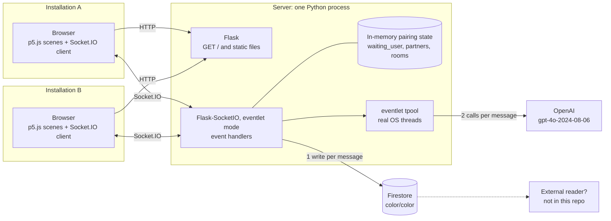
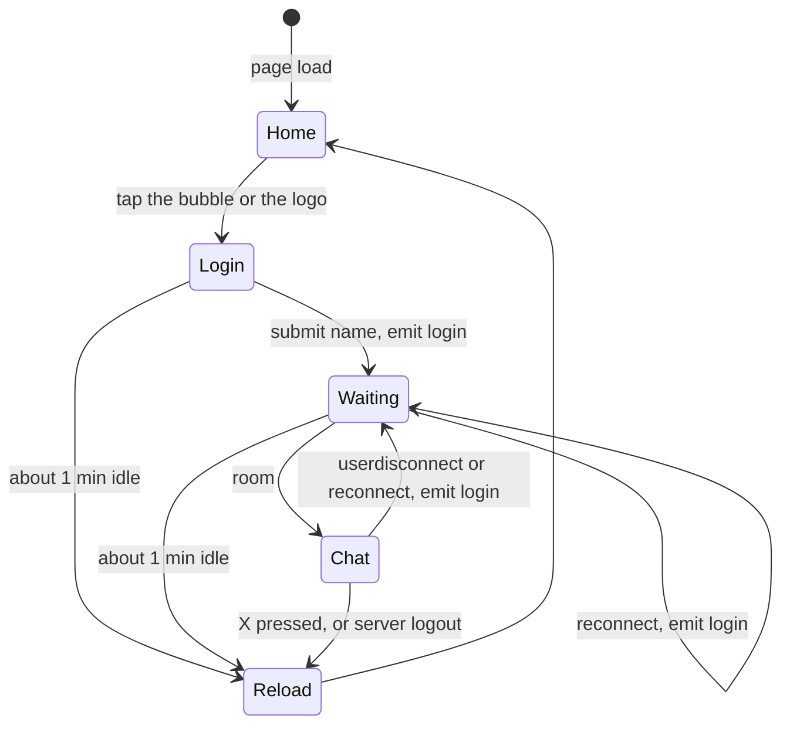
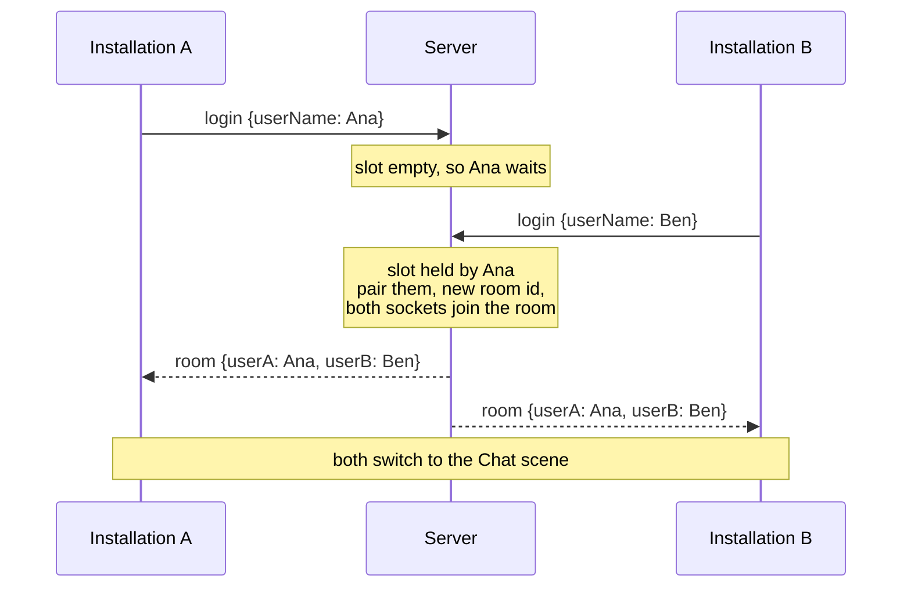
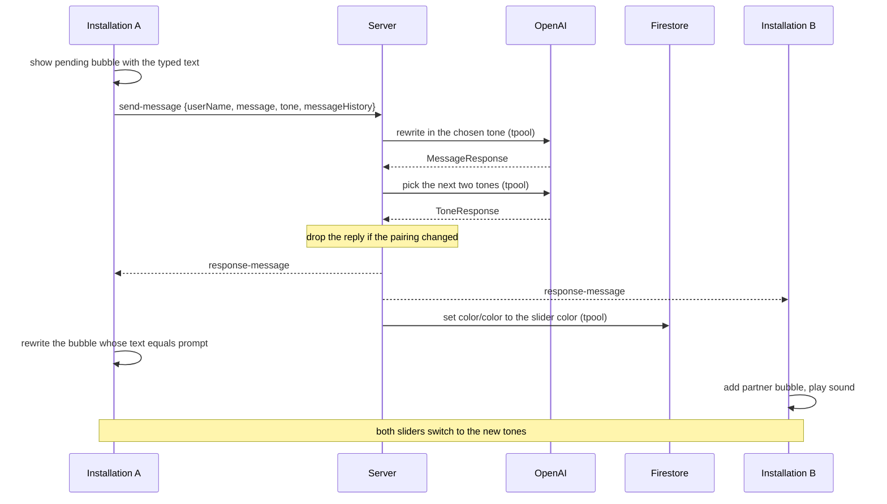
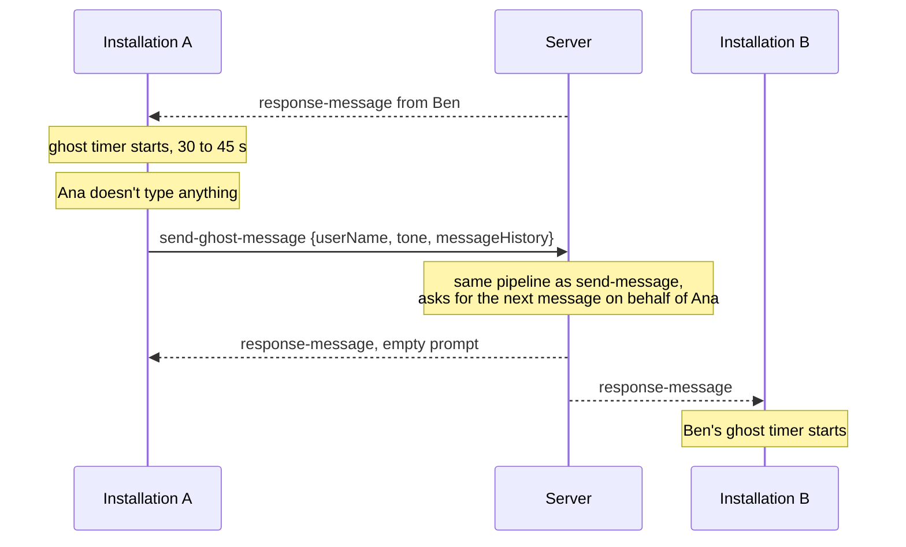
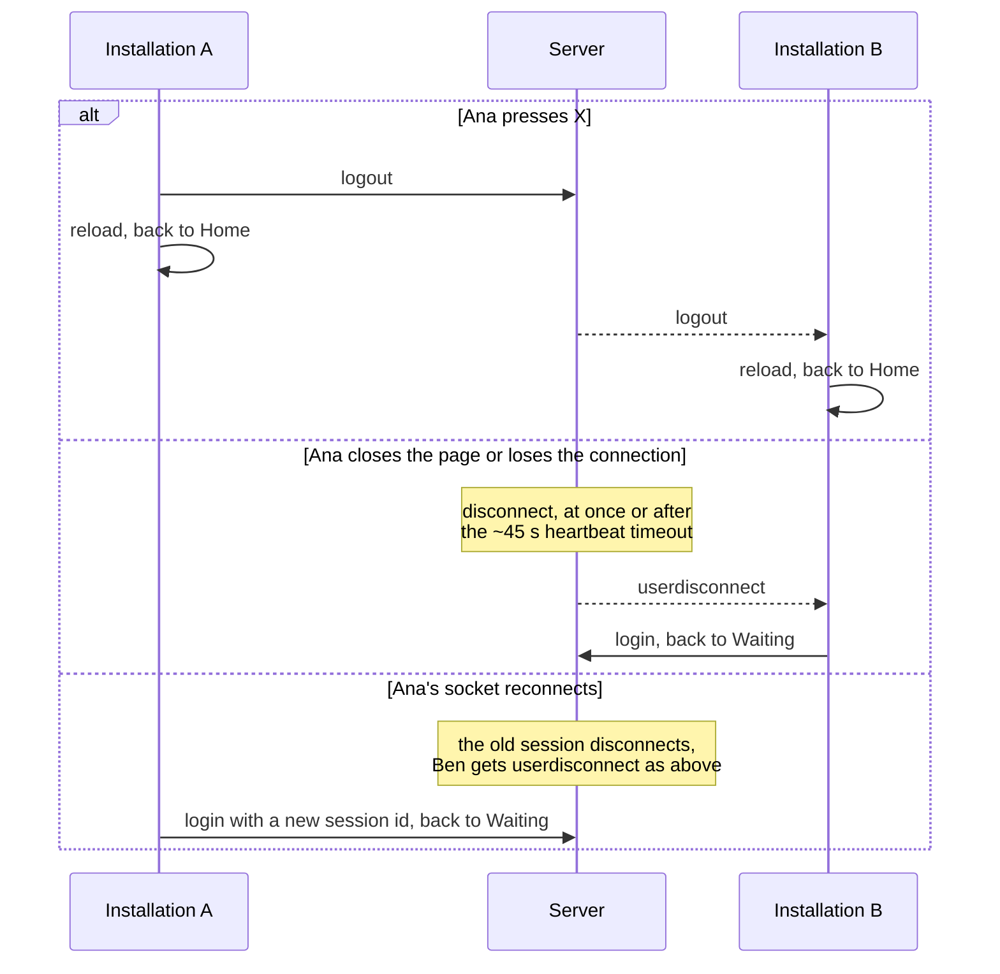

# Architecture

In Between Us connects two installations. A visitor at each one types a name, is paired with the visitor at the other installation, and they chat. Every message goes through OpenAI and is rewritten in the tone the sender picked on a slider before either side sees it. If a visitor stays silent, the AI writes a message on their behalf.

This document describes the code as of `c0b53ca` plus the uncommitted scene refactor ([scene.js](src/web/static/js/scene.js)). Line links will drift as the code changes. The [README](README.md) has a shorter summary, and [todo.md](todo.md) tracks open work.

## 1. System overview



- **Two browser clients.** Each installation is a browser showing the same page. Nothing tells them apart: the server treats any browser that opens the URL as a possible installation.
- **One server process.** Flask serves the page and static files. Flask-SocketIO, in eventlet mode, handles the socket events. All pairing state is in memory, so the server must run as a single process on a single instance.
- **OpenAI.** Each message costs two structured-output calls: one rewrites the text, the other picks the next pair of tones for the slider.
- **Firestore.** Only one document is used, `color/color`. It's overwritten with the sender's slider color on every delivered message. Nothing in this repo reads it back, so it may not be needed at all (A7 in [todo.md](todo.md)).

## 2. Server

| File | Role |
| --- | --- |
| [main.py](src/main.py) | App setup, socket handlers, pairing state, OpenAI and Firestore calls |
| [models.py](src/models.py) | Dataclasses for socket payloads, Pydantic models for OpenAI structured outputs |
| [config.py](src/config.py) | Reads `config.toml` (API key), defines the tone table and the tone prompt |
| [utils/json.py](src/utils/json.py) | snake_case ↔ camelCase conversion for payloads |

### Pairing state

```python
waiting_user: Optional[User]   # the one session waiting for a partner
partners: dict[str, User]      # session id -> the user they're talking to
rooms: dict[str, str]          # session id -> Socket.IO room id
```

A session is always in one of three states:

| State | Where it's recorded | Enters on | Leaves on |
| --- | --- | --- | --- |
| Connected | Nowhere | Socket connect | `login` |
| Waiting | `waiting_user` | `login` while the slot is empty | Someone else logs in, or its own `logout`, disconnect or new `login` |
| Paired | `partners`, `rooms`, and the Socket.IO room | `login` while someone else is waiting | Its own or its partner's `logout`, disconnect or new `login` |

Rules ([on_login](src/main.py#L50-L72), [end_session](src/main.py#L115-L130)):

- There is one waiting slot, first come, first served.
- A `login` first ends whatever the session was doing. If it was paired, the partner gets `userdisconnect`.
- Pairing creates a fresh room id (`uuid4`), puts both sockets in that Socket.IO room, and emits `room` to it.
- `end_session` removes both sides from `partners` and `rooms`, takes both out of the room, and sends the given event (`logout` or `userdisconnect`) to the partner.
- A restart clears everything. Clients in the Waiting or Chat scene log in again when their socket reconnects.

### Handling a message

[`respond()`](src/main.py#L133-L182) runs the same steps for `send-message` and `send-ghost-message`. Only the instruction differs:

1. Look up the sender's room. If they aren't paired, drop the event.
2. **OpenAI call 1:** rewrite the message, or write a new one for a ghost message, using the client-supplied history (`MessageResponse`).
3. **OpenAI call 2:** pick two tones from the list for the next message (`ToneResponse`).
4. If the sender's room changed while OpenAI was answering, drop the reply.
5. Emit `response-message` to the room, so both clients get it.
6. Write the sender's slider color to Firestore. A failure is only logged.

### Concurrency model

- The server runs eventlet **without monkey-patching**, because monkey-patching breaks the gRPC library that Firestore uses. Every handler runs as a green thread on one OS thread, so any blocking call freezes every client.
- OpenAI calls therefore go through `tpool.execute`, which runs them in a real thread (20 s timeout, one retry). The Firestore write does too (5 s timeout, no retry).
- `pairing_lock` is a real `threading.Lock`. That's safe only because nothing inside it yields.
- python-socketio runs each incoming event in its own green thread. Two events from the same client can be processed at the same time and finish in either order.

## 3. Client

The client uses p5.js in global mode. `setup()` builds every scene once, and `draw()` calls `currentScene.draw()` every frame.

| File | Role |
| --- | --- |
| [main.js](src/web/static/js/main.js) | p5 `setup`/`draw`, global state (`userName`, `recipientName`, `currentScene`), `changeScene`, idle reload timer |
| [scene.js](src/web/static/js/scene.js) | `Scene` base class: shows the scene's root element while current, optional socket hooks |
| [sockets.js](src/web/static/js/sockets.js) | `SocketService`: wraps `io()`, forwards server events to the current scene, emit helpers |
| [home.js](src/web/static/js/home.js) | Home scene: floating bubbles, "touch here to connect" |
| [loginScene.js](src/web/static/js/loginScene.js) | Name input |
| [waiting.js](src/web/static/js/waiting.js) | Emits `login`, waits for `room` |
| [chat.js](src/web/static/js/chat.js) | Conversation, pending bubbles, ghost-message timer |
| [message.js](src/web/static/js/message.js) | Bubble layout and drawing |
| [tone.js](src/web/static/js/tone.js) | Tone slider and the `tone` payload |
| [constants.js](src/web/static/js/constants.js) | Colors and the tone list (a copy of the one in `config.py`) |
| [sounds.js](src/web/static/js/sounds.js) | New-message sound |

### Scenes



"Reload" is `location.reload()`: the page starts over with a new socket, and the server sees the old one disconnect.

### Socket dispatch

`SocketService` forwards each server event to an optional hook on the current scene. Scenes without the hook ignore the event.

| Server event | Hook | Implemented by |
| --- | --- | --- |
| `connect`, when it's a reconnect | `onReconnect()` | Waiting, Chat: log in again |
| `room` | `onRoom(data)` | Waiting: set `recipientName`, go to Chat |
| `userdisconnect` | `onPartnerLeft()` | Chat: go back to Waiting |
| `response-message` | `onMessage(data)` | Chat: add or rewrite a bubble |
| `logout` | none | Always reloads the page |

### Chat scene

- **Own message.** A bubble with the typed text appears at once, with a pulsing "waiting" style. When `response-message` comes back with the visitor's own `userName`, the bubble whose text equals `prompt` is rewritten in place. If none matches (a ghost message), a new bubble is added on the visitor's side.
- **Partner's message.** Added as a new bubble, with a sound.
- **Tones.** Every `response-message` replaces the slider's two tones on both screens.
- **History.** Each event carries up to the last 10 messages, minus the newest one, as `{name, content}`. The server keeps no history of its own.
- **Ghost timer.** After the partner's message, or from the start of the chat, the client waits 30–45 s. If the visitor hasn't sent anything by then, it emits `send-ghost-message`.

## 4. Socket protocol

The client uses Socket.IO 4.6.1 and the server python-socketio 5.7.2, on the default namespace. There's no authentication, no acknowledgements and no error events. The heartbeat uses the defaults (25 s ping interval plus 20 s timeout), so a silently dead client is noticed after about 45 s.

### Client → server

| Event | Payload | Server action |
| --- | --- | --- |
| `login` | `{userName}` | End any current session, then take the waiting slot or pair with whoever holds it |
| `logout` | none | End the session. The partner gets `logout` |
| `send-message` | see below | Rewrite through OpenAI, emit `response-message` to the room |
| `send-ghost-message` | same, without `message` | Write a message on the sender's behalf, emit `response-message` to the room |

```jsonc
// send-message
{
  "userName": "Ana",
  "message": "hi, how are you?",
  "tone": {
    "tone1": "Formal",   "tone1Value": 0.3,   // 1 - slider position
    "tone2": "Informal", "tone2Value": 0.7,   // slider position
    "color": "#3a8fb0"                        // slider color, written to Firestore
  },
  "messageHistory": [{ "name": "Ben", "content": "hello there" }]
}
```

The server rewrites the message to sound `max(tone1Value, tone2Value)`% more like the stronger tone.

### Server → client

| Event | Sent to | Payload |
| --- | --- | --- |
| `room` | Both, via the room | `{active: true, userA: {sessionId, userName}, userB: {sessionId, userName}}`. `userA` was waiting, `userB` just logged in |
| `response-message` | Both, via the room | See below |
| `userdisconnect` | The partner | `{message: "user disconnected."}` |
| `logout` | The partner | `{message: "user has logged out."}` |

```jsonc
// response-message
{
  "message": "Good afternoon. How are you?",   // rewritten text
  "userName": "Ana",                           // sender, as the sender's client claimed
  "prompt": "hi, how are you?",                // original text, "" for ghost messages
  "tone1": { "name": "Humorous", "color": { "r": 255, "g": 255, "b": 28 } },
  "tone2": { "name": "Serious",  "color": { "r": 0,   "g": 195, "b": 255 } },
  "color": "#3a8fb0"                           // not used by the client
}
```

## 5. Flows

### Pairing



### Sending a message



### Ghost message



If neither visitor types, the two installations keep answering each other. See F4 in [todo.md](todo.md).

### Ending a chat



## 6. Use cases

| # | Use case | Trigger | What happens | Events |
| --- | --- | --- | --- | --- |
| 1 | Start a conversation | A visitor taps "touch here to connect" and enters a name | The installation shows "Waiting for someone to join." | `login` |
| 2 | Get paired | A second visitor logs in while the first is waiting | Both screens show "You are talking to …" | `room` |
| 3 | Send a message | The visitor types and presses send | The bubble appears at once, then is replaced with the rewritten text. The partner sees only the rewritten text. Both sliders get new tones | `send-message`, `response-message` |
| 4 | Choose a tone | The visitor drags the slider | The next message is rewritten toward the stronger tone. The send button takes the slider color | none until the next send |
| 5 | Stay silent | 30–45 s without sending after the partner's message, or after the chat starts | The AI writes a message for the silent visitor | `send-ghost-message`, `response-message` |
| 6 | Leave on purpose | The visitor presses X | Both installations go back to Home | `logout`, then `logout` to the partner |
| 7 | Walk away | The page closes, the browser crashes or the power goes | The partner goes back to Waiting, after up to ~45 s if the client died without closing | `userdisconnect` |
| 8 | Network blip | The socket reconnects | Both clients log in again and are paired again. The conversation is cleared | `userdisconnect`, `login`, `room` |
| 9 | Nobody at the other installation | A visitor waits about a minute | The page reloads to Home. Visitors at the two installations have to arrive within about a minute of each other to meet | none (reload) |
| 10 | Server restart | Deploy or crash | Pairing state is lost. Clients in Waiting or Chat log in again on reconnect | `login` |
| 11 | Color output | Every delivered message | The sender's slider color is written to Firestore `color/color` | none |

## 7. Flaws and risks

The problems found in this review are tracked in [todo.md](todo.md), each with an ID (S1, P1, …), a severity, a fix, and a suggested order to work in.
